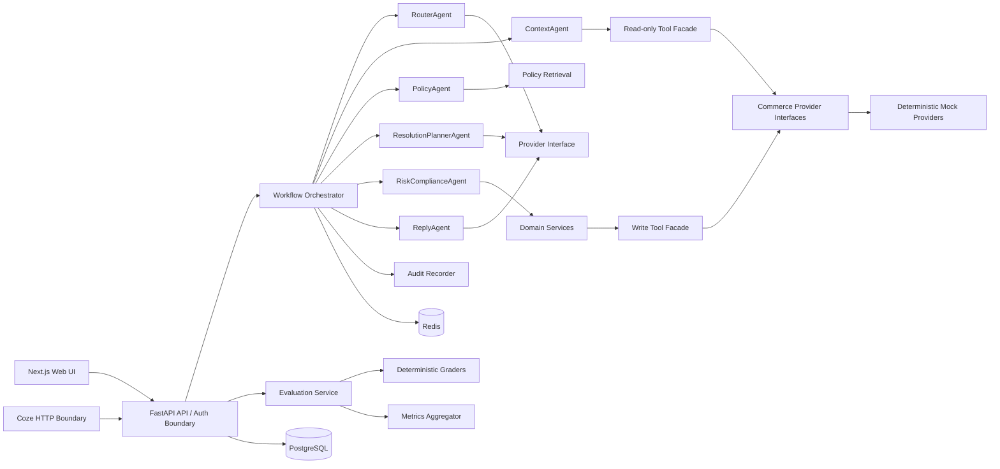
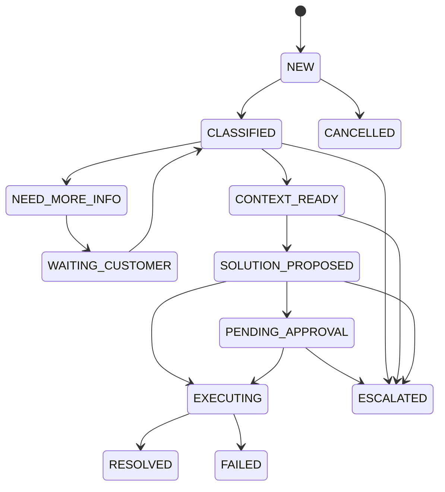

# Architecture

## 1. 结构

## 2. 责任边界

HTTP 层只负责认证、授权入口、请求校验和响应转换。Workflow Orchestrator 只编排步骤及持久化运行状态，不能绕开领域服务。Agent 只能产生受 schema 限制的分析或建议，不能直接持有数据库会话或写 provider。Domain Service 负责状态迁移、策略与权限二次校验、幂等和事件记录。Provider adapter 隔离订单、库存、物流、退款、退货、消息与承运商系统。

关键 Agent 输出若 schema 失败，带校验错误重试一次；再次失败后安全降级为 `ESCALATE`，并创建可审计的人工工单。

## 3. 状态机

迁移由 `TicketDomainService.transition()` 统一执行；迁移表是 allow-list，非法迁移抛出 `InvalidStateTransitionError(code="INVALID_STATE_TRANSITION")`。

## 4. Agent 与可信数据

| Agent | 输入/输出 | 约束 |
| --- | --- | --- |
| RouterAgent | 消息 → 分类 schema | 不可信输入；提取而非执行 |
| ContextAgent | 引用 → 事实列表 | 只读；事实含 `source_type`、`source_id`、`observed_at` |
| PolicyAgent | 条件 → 策略证据 | 只返回已生效、可适用的版本判断 |
| ResolutionPlannerAgent | 事实/证据 → 方案 | 1–3 个方案，不能执行 |
| RiskComplianceAgent | 方案/事实 → 决策 | 确定性规则优先，模型仅可提供解释摘要 |
| ReplyAgent | 已确认材料 → 回复 | 不得把推断写成事实，不得泄露内部信息 |

## 5. Coze 边界

将提供无状态、签名认证的 HTTP 边界以接入 `wf_customer_intake`、`wf_order_context`、`wf_policy_retrieval`、`wf_resolution_plan`、`wf_risk_gate`、`wf_execute_action`、`wf_ticket_sync`、`wf_customer_reply`、`wf_quality_review`。每个端点采用版本化输入/输出 schema，并把 Coze 看作不可信调用者；核心交易状态仍归本系统所有。详细 request 示例与 schema 在 Phase 4 的 `workflows/coze/README.md` 交付。

## Phase 4 runtime contract

Each Agent invokes a `StructuredOutputProvider` with a resolved prompt key/version and a Pydantic output schema. The runtime retries a validation failure once with a compact validation summary. A second failure returns an auditable `ESCALATE` outcome; it does not invent a result and cannot call a write provider. The default local provider is deterministic; the optional OpenAI-compatible adapter is disabled unless explicitly configured.

The first executable Coze boundary is `wf_customer_intake`: it is HMAC-signed, schema-versioned, read-only, and returns only the Router decision. Subsequent Coze flow contracts are documented but do not receive database credentials or permission to call domain write services.

## Phase 5 evaluation and reliability contract

`EvaluationService` reads versioned synthetic `eval_cases`, invokes only schema-bound analysis/read-only retrieval, then persists a run/result report and a redacted audit event. It never invokes an after-sales Domain Service, write provider, outbox dispatcher, or customer-facing message endpoint. Deterministic graders own release thresholds: a critical failure produces `blocked`; a non-critical rate below the quality SLO produces `attention`.

`MetricsService` aggregates durable workflow, action, outbox, Agent, audit, and latest evaluation records. It exposes counts and bounded latency aggregates to authorized staff; it does not expose prompt text, raw customer messages, private reasoning, or secrets.
